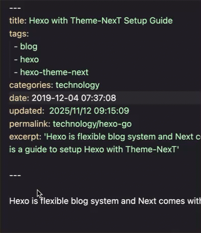

# Hexo Auto Updated
A Visual Studio Code extension that update timestamp of `updated` in front matter of hexo when saving markdown document.

## Features
Update last updated date and time in front matter when saving document



Each of the fields will be detected with condition of settings.
By default settings, lines like the following will be detected:
```
// updated: 2025-11-09 11:00:00
```


## Author
[Leon D. Qiu](https://github.com/qzi) inspired by lpubsppop01@[vscode-auto-timestamp](https://github.com/lpubsppop01/vscode-auto-timestamp) 

## License
[zlib License](https://github.com/lpubsppop01/vscode-auto-timestamp/raw/master/LICENSE.txt)
